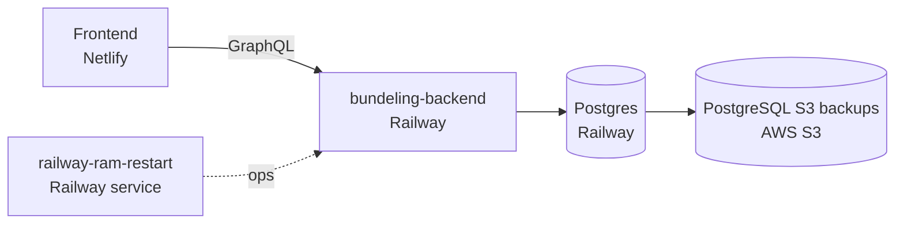

# Deploy Runbook (Railway + Netlify)

Lean release flow for:
- Backend: Strapi on Railway
- Frontend: Next.js on Netlify
- No staging environment

## Goal
Ship safely with minimal process overhead by:
1. Turning on frontend maintenance first
2. Deploying Strapi
3. Validating with quick smoke checks
4. Turning maintenance off

## Architecture (Current)



## Pre-Deploy (T-30 to T-10)
- [ ] Both repos pushed and up to date
- [ ] Frontend has `NEXT_PUBLIC_FORCE_MAINTENANCE` support
- [ ] Frontend smoke test works locally: `pnpm live-test`
- [ ] Netlify deploy dashboard open
- [ ] Railway service + logs open
- [ ] Terminal ready for production smoke test command

## Database Safety (Do This Before Deploy)
- [ ] Pull latest auto backup from AWS S3 (Railway backup target)
- [ ] Restore it to local test DB
- [ ] Confirm restore succeeds before deploy

Use Railway's already-generated backups from S3 as your rollback baseline.

How to pull latest from AWS Console:
1. Open AWS Console > S3.
2. Open the bucket used by Railway PostgreSQL backups.
3. Open the backup prefix/folder (for example, strapi-backups).
4. Sort by Last modified and download the newest dump file.
5. Keep that file ready for restore/rollback.

## Deploy Start (T-0)
1. In Netlify, set env var: `NEXT_PUBLIC_FORCE_MAINTENANCE=true`
2. Trigger frontend deploy
3. Confirm production site shows maintenance page

## Deploy Backend (T+5)
1. Deploy Strapi on Railway
2. Watch Railway logs until healthy
3. Run one quick GraphQL sanity check (query returns data)

## Validate While Maintenance Is On (T+15)
1. Run smoke tests against production:
   - `BASE_URL=https://your-domain pnpm live-test`
2. If all pass, continue
3. If fail, rollback Strapi immediately

## Open Site (T+20)
1. In Netlify, set env var: `NEXT_PUBLIC_FORCE_MAINTENANCE=false`
2. Trigger frontend deploy
3. Re-run production smoke tests:
   - `BASE_URL=https://your-domain pnpm live-test`
4. Quick manual spot-check:
   - Home page
   - Contact page (and submit if safe)
   - One dynamic content page

## Rollback Rules (Simple)
Rollback immediately if:
- Strapi is not healthy within about 10 minutes
- Production smoke tests fail after Strapi deploy

Rollback steps:
1. Keep maintenance mode ON
2. Roll back Strapi in Railway to previous healthy release
3. Validate API health quickly
4. Set `NEXT_PUBLIC_FORCE_MAINTENANCE=false` in Netlify
5. Redeploy frontend
6. Re-run production smoke tests

## Timebox
- Normal path: 45 to 75 minutes
- With rollback: 90 to 120 minutes

## Copy/Paste Commands
Restore backup to a local test DB:

```bash
pg_restore -h 127.0.0.1 -p 5432 -U strapi -d strapi_test --no-owner --no-privileges -v /path/to/downloaded-latest.dump
```

Local smoke test:

```bash
pnpm live-test
```

Production smoke test:

```bash
BASE_URL=https://your-domain pnpm live-test
```

Optional quick GraphQL health check:

```bash
curl -sS -X POST https://your-strapi-domain/graphql \
  -H "Content-Type: application/json" \
  -d '{"query":"{ __typename }"}'
```
